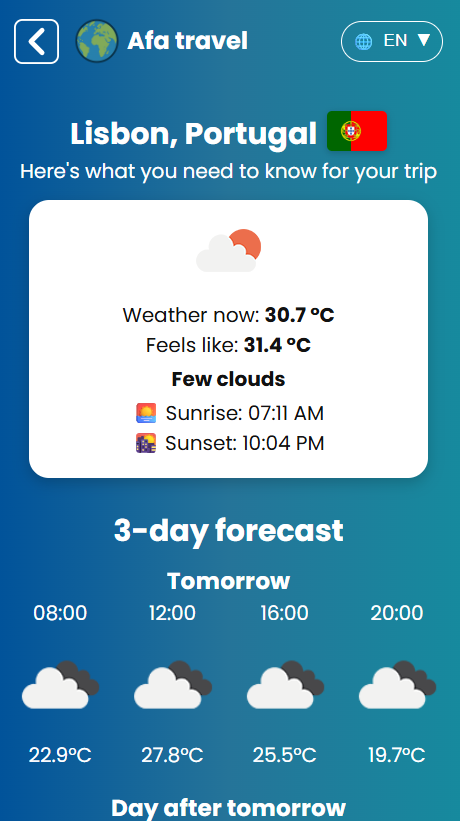

## Afa travel
This is a learning web project built to practice working with APIs, `localStorage`, and multilingual support using JSON files and `data-i18n` attributes. This responsive application helps users plan their travels by selecting a country and city to view weather, gallery images, and key facts about the destination.

> The layout is built with a mobile-first approach, as the majority of website visitors use mobile devices. The project is fully responsive and adapts to both desktop and tablet screens.

## Key Features
- Multilingual interface (English, Czech, Russian) with instant switching via JSON translation files
- LocalStorage for saving user-selected languages and favorite cities
- Live weather forecast using [OpenWeatherMap API](https://openweathermap.org/)
- Country information (flag, population, area, currency, languages) using [REST Countries API](https://restcountries.com/)
- Automatically generated gallery for selected cities
- Option to save and manage favorite destinations

## Technologies Used

- HTML5, CSS3, JavaScript (Vanilla JS)
- `fetch()` for asynchronous API requests
- `localStorage` for persistent user data
- `Swiper.js` for mobile-friendly sliders
- JSON-based internationalization system
- Dynamic country and city selection powered by JSON data files

## How to Start

Open the project on GitHub Pages:  
[https://darogible.github.io/Afa-travel/](https://darogible.github.io/Afa-travel/)

Or clone the repository and open `index.html` in your browser

## Preview (Mobile)

  
  

## Preview (Desktop)

  
  

